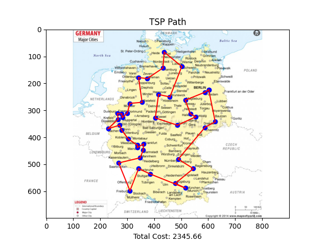
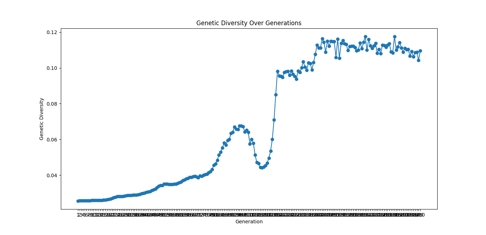

# Genetic Algorithm for Traveling Salesman Problem (TSP)

This project implements a **Genetic Algorithm (GA)** to solve the Traveling Salesman Problem (TSP). Using a graph-based representation, the algorithm finds an optimized path through all given cities while minimizing the total travel distance. This approach employs natural selection-inspired techniques, including crossover, mutation, and fitness selection.

## Table of Contents

- [Introduction](#introduction)
- [Algorithm Overview](#algorithm-overview)
- [Usage](#usage)
  
## Introduction

The Traveling Salesman Problem (TSP) is a classic optimization problem where the goal is to determine the shortest possible route that visits each city exactly once and returns to the starting city. Genetic algorithms are particularly suitable for this problem due to their ability to efficiently search large solution spaces through evolutionary operations.

## Algorithm Overview

The algorithm follows these primary steps:

1. **Population Initialization**: Generates an initial population of random routes.
2. **Fitness Evaluation**: Each route is evaluated based on total distance; shorter distances indicate higher fitness.
3. **Selection**: The tournament selection process chooses a subset of routes with higher fitness scores.
4. **Crossover**: Creates new offspring routes by combining segments of two parent routes.
5. **Mutation**: Randomly alters a small portion of routes to maintain genetic diversity.
6. **Generational Iteration**: The process repeats for a set number of generations, refining the population towards shorter routes.

## Usage
1. Ensure you have Python 3.x installed on your system.
2. Clone the repository or download the source files.
3. Create a `cities.txt` file in the project directory with the city information in the following format:
```shell
City1: (x1, y1)
City2: (x2, y2)
...
```
4. Run the `main.py` script to execute the Genetic Algorithm and visualize the results.
```shell
python main.py
```

The script will output the fittest path found by the Genetic Algorithm, along with the total cost (distance) of the path. It will also generate two plots:

1. A plot of the TSP path, showing the nodes (cities), the edges (paths between cities), and the total cost.
2. A plot of the genetic diversity over the generations.

### Shortest Route Found
This plot shows the shortest route identified by the algorithm after execution.



### Genetic Diversity Over Generations
This plot illustrates the genetic diversity of the population across generations.


